# Bevezetés

A fejlett országokban az emberek többsége rendelkezik már telefonnal. Telefonálhívást kezdeményeznek vagy fogadnak, üzenetet írnak vagy fogadnak, illetve fekapcsolódnak az internetre. Ezeket az eseményeket a telekommunikációs szolgáltatók naplózzák, illetve időbélyeggel és a georáfiai hely információval látják el. Ezeket CDR-nek, azaz Call Detail Record-nak nevezzük.
A naplókat nagy méretű adatbázisoknak kell elképzelni, amibe minden CDR bekerül. A nagy méretű adatbázisok tárolására és elérésére használt algoritmusok és rendszerek az útóbbi időben sokat fejlődtek (ez a *big data* témaköre). Ezeknek a nagy méretű adatbázisoknak az elemzését segítik a mesterséges tanulásban elért eredmények.
Ez utóbbit használom a dolgozatomban arra, hogy egy nagy méretű adatbázist elemezve megtaláljam az események közt az anomáliákat. Ilyen lehet egy sport rendezvény, egy koncert, egy tüntetés, stb. Egy ilyen alkalmazás segíthet a rendőrségnek és a mentő szolgálatoknak spontán kialakuló tömegek azonosításában és a kapcsolódó eseményekre / vészhelyzetekre való felkészülésében.
2014 elején a Telecom Italia egy versenyt hírdetett *big data* témakörben, melynek keretében közzétette a 2013 novemberében és decemberében Milánóban készült CDR-eket. Az adatok anonimizáltak, így a CDR-ek segítségével nem azonosíthatók be a  szolgáltató ügyfelei. Ezt az adathalmazt fogom elemezni a dolgozatomban és ezekkel az adatokkal szimulálom a valós időben beérkező adatfeldogozását is.

# Felhasználói dokumentáció

Az Anomaly Detector egy webalkalmazás, amivel anomáliákat lehet keresni Milánóban, 2013 decemberéből. Az anomáliákat a Telecom Italia telekommunikációs eseményei elemzésével határozza meg. Az alkalmazással valós idejű adatfeldolgozást is lehet szimulálni.
Az alkalmazás alkalmi használatra ajánlott. Azoknak lehet hasznos, akik kíváncsiak arra, hogy egy adott 2013 decemberi esemény Milánóban mennyire befolyásolta az emberek mobiltelefon használati szokásait. Például egy sport esemény vagy egy színházi előadás. Esetleg kimutatható-e anomália az eseményhez köthetően. Azok számára is érdekes lehet ez az alkalmazás, akik szeretnék jobban megismerni a mobilhasználati szokásokat Milánóban. Rendszeres használatra nem ajánlott, hisz nem tartalmaz ezt ösztönző funkciót, mint például valós időben beérkező adatok elemzése és vizualizálása. De azoknak, akiknek egy ilyen szoftver hasznos lenne (rendfenntartó szervek, mentő szolgálat vagy maga a telekommunikációs vállalat), láthatnak egy példát, hogy milyen eredménnyel lehetne anomáliákat detektálni egy hasonló adathalmazban, ha ők azt valós időben feldogoznák.
A webalkalmazás nem igényel semmilyen egyéb hardvert vagy szoftvert, mint amit a böngésző ajánlj. Fejlesztve és tesztelve 62-es Google Chrome és 57-es Firefox böngészőkkel lett. A térkép betöltése és frissítése viszont nagyban függ az internetkapcsolat sebességétől. Illetve egy nagy felbontású képernyő segíthet a grafikonok elemzésében.
A webalkalmazás indításához csak a weboldalt kell betölteni egy böngésző segítségével. A javascript kódok futtatását engedélyezni kell, ha azok ki lennének kapcsolva.

## Az alkalmazás funkcióinak bemutatása

### Szimulációs oldal

A weboldalt betöltve a következő képernyő fogad:
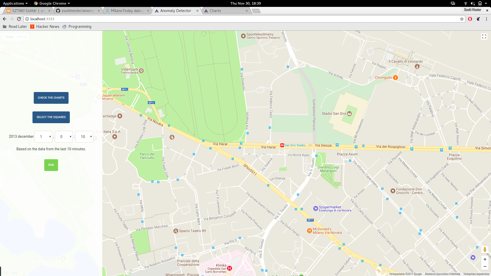
Ezen az odalon lehet szimulációt indítani, a kiválasztott kezdő dátummal és területtel.
A képernyő egészét elfoglalja a térkép. A térképet hasonlóan lehet mozgatni, mint egy Google Maps-et: egérrel húzogatható, és dupla kattintással, egér görgővel és a jobb alsó sarokban lévő gombokkal közelíthető / távolítható.
Bal oldalon található a menü, aminek fehér háttere kicsit áttetsző. A legfelső gomb (*CHECK THE CHARTS*) a grafikon nézegető képernyőre visz el, amiről a következő fejezetben lesz szó. A következő gomb, a *SELECT THE SQUARES*, a terület kiválasztó oldalra visz el, amiről szintén később lesz szó. A gomb alatt lévő sorban a dátumot válaszhatjuk ki: december egy tetszőleges napját és óráját, illetve 0, 10, 20, 30, 40 vagy 50 percet. A menü alján lévő zöld *RUN* gombal indítható a szimuláció. Amíg a szimuláció fut, addig a zöld *RUN* gombot egy piros *STOP* gomb cseréli le, ami alatt kékkel tájékoztató üzenetek jelennek meg:
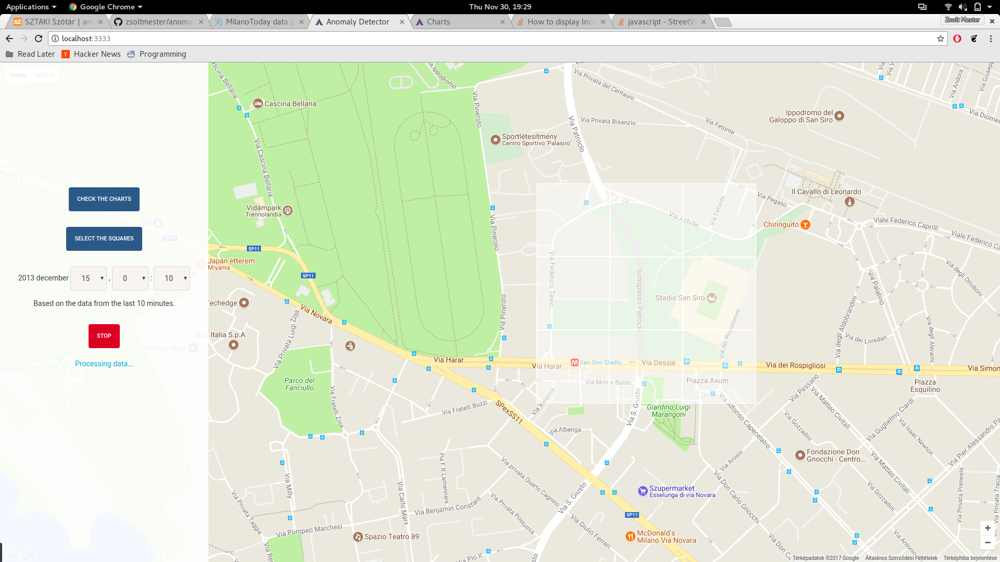

A szimuláció indításakor a kiválasztott területek négyzetei is megjelennek a térképen, fehérrel színezve. A négyzetekre kattintva megjelenik egy információs ablak, amiben még csak a terület azonosítója és az időpont látható:
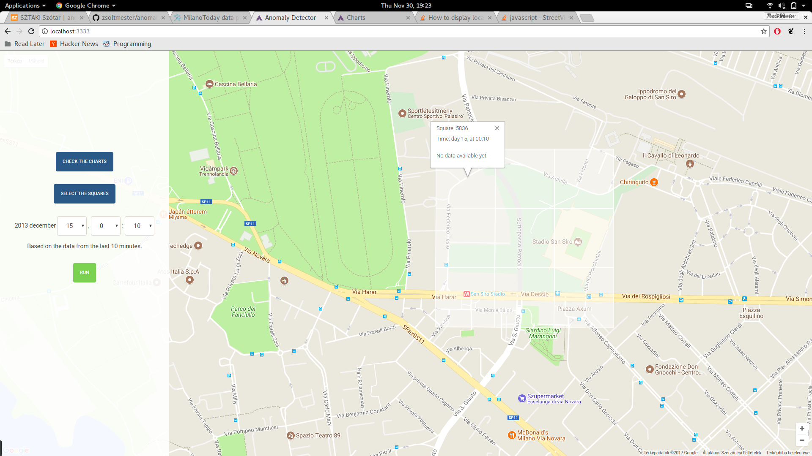
Az indítás után az időpont és a terület nem módosítható, csak leállítás után. A szimuláció egy lépése a következőkből áll:
1. Beállíjuk, hogy mikor érkeztek be az adatok. Ilyenkor a *Processing data...* üzenet jelenik meg a menü alján.
2. Feldolgozzuk és elemezzük az adatokat. Az eddig megjelenített üzenet a menüben nem változik.
3. Megjelenítjük az eredményt a térképen. Az eddig megjelenített üzenet a menüben nem változik. Viszont a térképen a területek színe megváltozik egy, a teljesen átlátszó piros és az átlátszatlan piros szín közti állapotra. **A szín erőssége jelzi, hogy mekkora eséllyel történt anomália a környéken.**
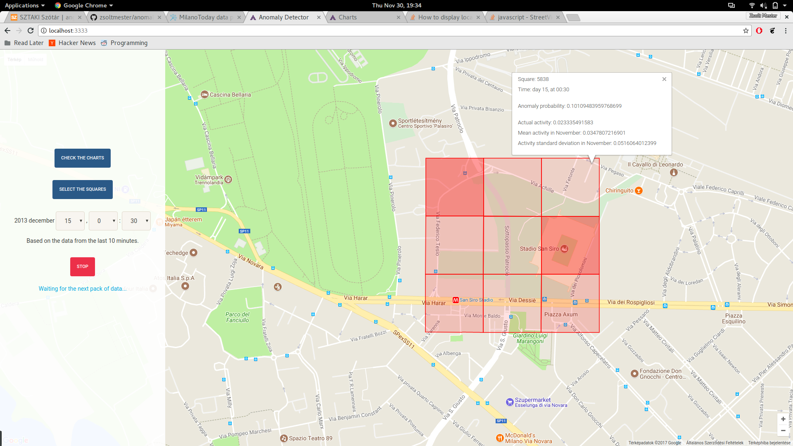
Az információs ablakban ekkor a következők jelennek meg:
	- A terület azonosítója, ami egy 1 és 10000 közti egész szám.
	- Az anomália valószínűsége. Ez egy pozitív valós szám, aminek **értéke 1-nél is nagyobb lehet**. Ez az érték felel meg a négyzet színének. Ha az érték 0, akkor a négyzet teljesen átlátszó, ha 1, vagy annál nagyobb, akkor teljesen piros.
	- Az aktuális aktivitás értéke, ami egy pozitív valós szám.
	- A novemberi átlagos aktivitás értéke, ami egy pozitív valós szám.
	- A novemberi aktivitás szórása, ami egy pozitív valós szám.
4. Várunk a következő adathalmaz érkezésére. A tájékoztató üzenet a következőre változik: *Waiting for the next pack of data...*. Az alkalmazás azt szimulálja, hogy 10 percenként érkeznek be az adatok, de nem vár ennyit, különben használhatatlanul lassú lenne a szimulációs mód.
A szimuláció addig fut, még azt le nem állítjuk, vagy el nem fogynak az adatok (azaz december 31, 23:50-ig tud futni). A szimuláció bármikor megállítható.

Hiba esetén a következő tájékoztató szöveg jelenik meg: *Something unexpected happened.*, és leáll a szimuláció.

#### Példa használat

Válassza ki a San Siro stadiont:
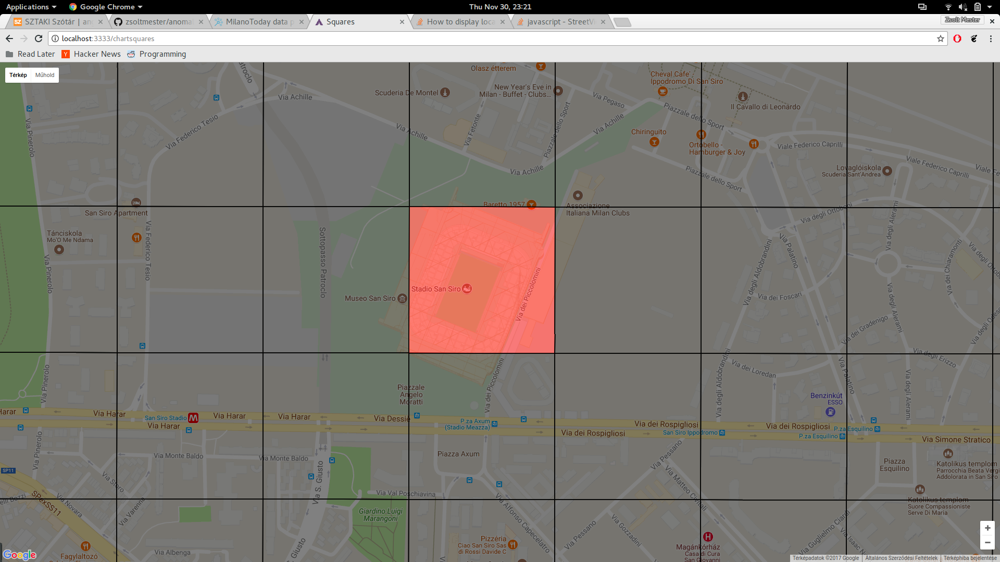
Válassza ki december elsejét és délután 5 órát, majd indítsa el a szimulációt. Kezdetben ezt fogja:
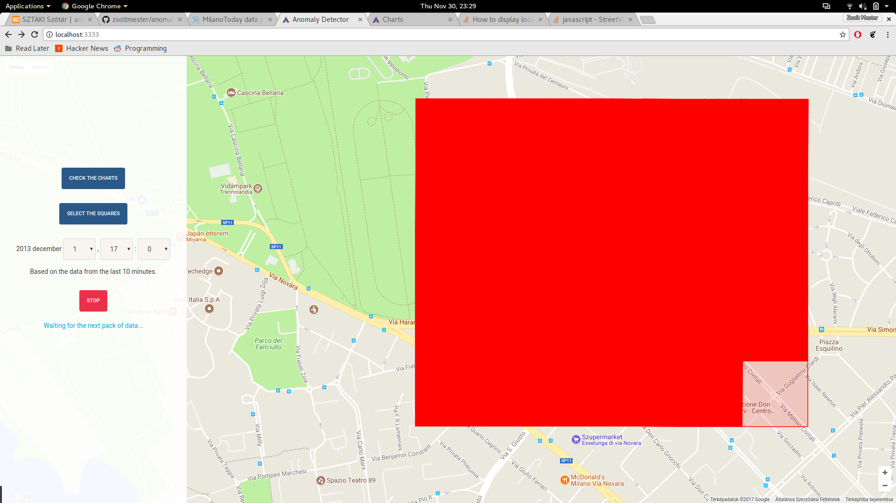
Majd eljut eddig:
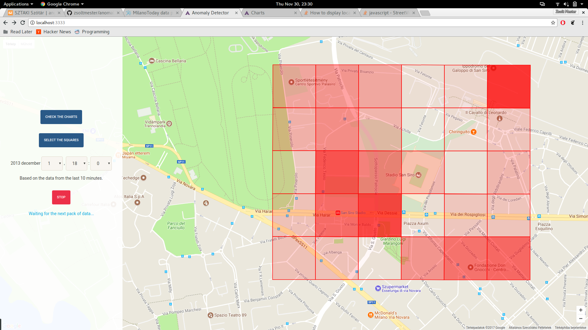
Nyomja meg a *STOP* gombot.
Ezen a napon egy Inter - Sampdoria focimeccs volt, ami délután 5 körül ért véget. Látni, hogy a tömeg körülbelül 1 óra alatt vonult el a környékről.

### Grafikon elemző oldal

Ide akkor juthat, ha a szimulációs oldal menüjében megnyomta a *CHECK THE CHARTS* gombot. Az oldal kezdetben így néz ki:
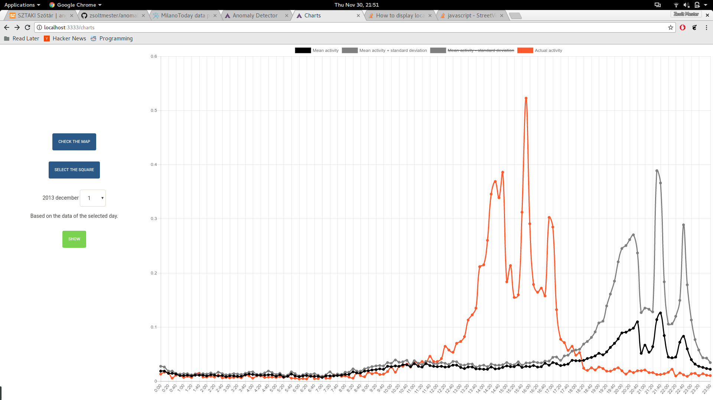
Ezen a képernyőn lehet grafikonon megnézni hogy az adott napon és az adott területen milyen volt:
- az adott napi aktivitás, (narancs vonal)
- a novemberi átlagos aktivitás, (fekete vonal)
- a novemberi átlagos aktivitás és a novemberi szórás összege, (szürke vonal)
- a novemberi átlagos aktivitás és a novemberi szórás különbsége. (ez is szürke vonal)

A képernyő jobb oldalát egy grafikon foglalja el, a bal oldalát pedig egy menü.
A menü első gombja (*CHECK THE MAP*) a szimulációs oldalra visz. A második gomb (*SELECT THE SQUARE*) a terület kiválasztó oldalra (erről majd a következő fejezetben lehet olvasni). A második gomb alatti sorban a dátumot lehet kiválasztani, mégpedig 2013 december egy tetszőleges napját. A menü alján a zöld *SHOW* gombbal lehet lekérni a grafikont. A lekérés közben a *SHOW* gomb alatt egy kék tájékoztató szöveg jelzi, hogy dolgozik az oldal: *Processing data...*.
A grafikon vízszintes tengelye az időt reprezentálja: 00:00-tól 23:50-ig, 10 perces bontásban. A függőleges tengely az aktivitásnak felel meg, ami egy pozitív valós szám lehet. A grafikon tetején a vonalak címe és a hozzájuk tartozó szín található. A címükre kattintva ki-be kapcsolhatóak a vonalak. A második szürke vonal kezdetben ki van kapcsolva. A grafikonon mozgatva az egeret minden időpontra képes megjelennek a vonalak pontos értékei:
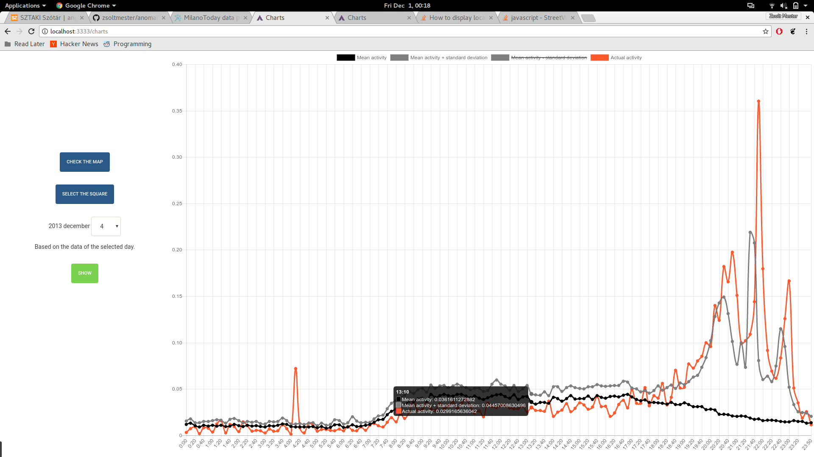

Hiba esetén a következő tájékoztató szöveg jelenik meg: *Something unexpected happened.*.

#### Példa beállítás

Válassza ki a San Siro stadiont:

Válassza ki december elsejét és nyomja meg a *SHOW* gombot. Ekkor ezt fogja látni:
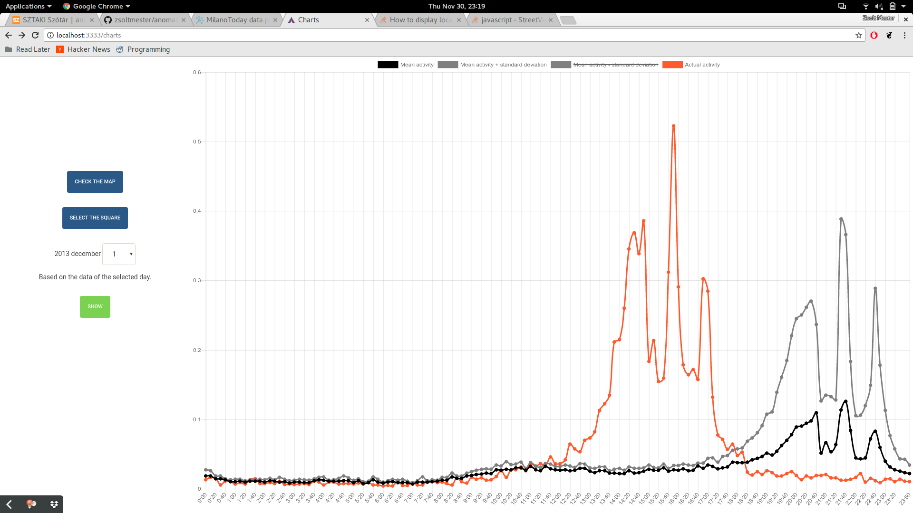
Azt látni, a délután 3 órakor kezdődő Inter - Sampdoria focimeccs előtt, a szünetben és a meccs után kiugró volt az aktivitás (naracssárga vonal). A novemberi átlagból azt is látszik, hogy a legtöbb novemberi meccs este 8-kor kezdődött. Ezért ilyen kiugró az átlag és a szórás.

### Terület kiválasztó oldal

Ide akkor juthat, ha a főoldalon vagy a grafikon elemző oldalon a *CHECK THE SQUARE(S)* gombokra kattintott. Az oldalnak két állapota van, attól függően, hogy a szimulációs oldalról vagy a grafikon elemző oldalról jött ide. A képernyő, ha a főoldalról jött ide, kezdetben így néz ki:

A képernyő, ha a grafikon elemző oldalról jött ide, kezdetben így néz ki:
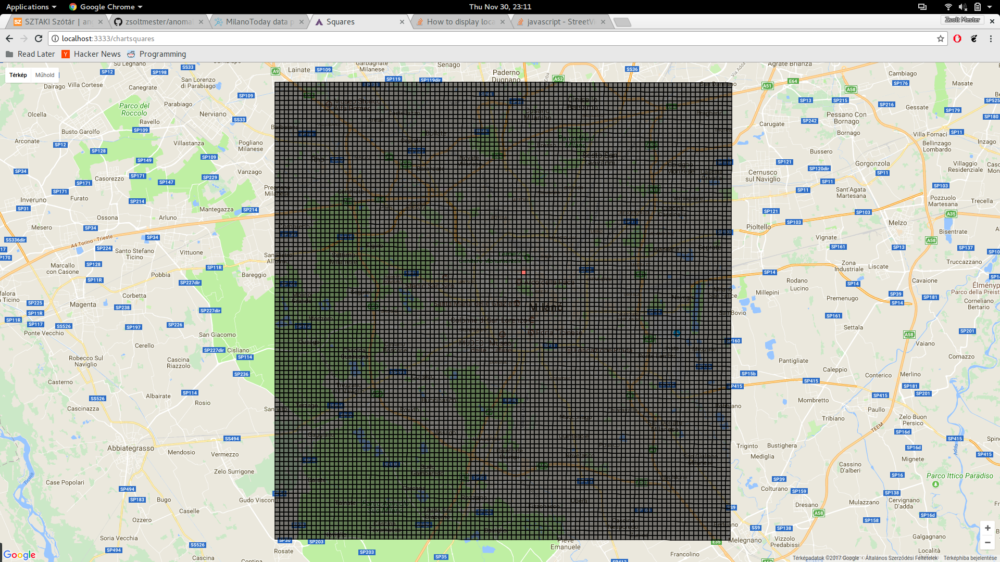
Ezen az oldalon választhatjuk ki azokat a területeket, amiket elemezni akarunk a szimulációban vagy a grafikonokon. **Szimuláció esetén több terület is kiválasztható (akár az összes, de legalább 1), grafikon esetén viszont csak pontosan 1.**
A térképen hasonlóan mozoghatunk, mint a a szimulációs oldal térképén. A területeket kattintással jelölhetjük ki / törölhetjük ki a jelölést. A piros négyzetek a kijelölt négyzetek, a feketék a nem kijelöltek:
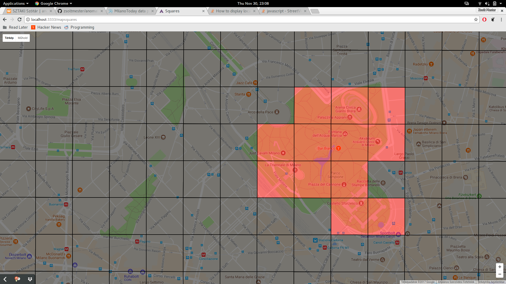
A kijelölés azonnal érvénybe lép, így egy vissza navigálás után, már ennek megfelően fog működni a szimuláció és ennek megfelelően jelennek meg az adatok a grafikonokon is.

# Fejlesztői dokumentáció

## Megoldási terv

### A probléma részletes specifikációja

#### Adathalmaz

A Telecom Italia 2014 elején közzétette a 2013 novemberében és decemberében, Milánóban naplózott felhasználói aktivitást. Jelenleg mindenki számára elérhető a *dandelion.eu*-n, ami így mutatja be az adathalmazt:
> At the beginning of 2014, Telecom Italia launched the first edition of the Big Data Challenge, a contest designed to stimulate the creation and development of innovative technological ideas in the Big Data field. SpazioDati is the technology partner hosting the data distribution platform, using dandelion.eu.
> Datasets were released only to be used by the participants: after the end of the contest, the demand for those datasets has raised. That's why the initiative “Open Big Data” was born.
> We now have that data freely available for anyone to use: we publish it as Open Data because we want people to reuse it!

(https://dandelion.eu/datamine/open-big-data/, 2017. 12. 02.)

ODbL (Open Data Commons Open Database License) 1.0 licensz alatt érhető el.

Az adathalmaz specifikációja a *dandelion.eu*-ról:
> This dataset provides information about the telecommunication activity over the city.
>
> The dataset is the result of a computation over the Call Detail Records (CDRs) generated by the Telecom Italia cellular network over the city. CDRs log the user activity for billing purposes and network management. There are many types of CDRs, for the generation of this dataset we considered those related to the following activities:
>- Received SMS: a CDR is generated each time a user receives an SMS
>- Sent SMS: a CDR is generated each time a user sends an SMS
>- Incoming Calls: a CDR is generated each time a user receives a call
>- Outgoing Calls: CDR is generated each time a user issues a call
>- Internet: a CDR is generate each time
>	- a user starts an internet connection
>	- a user ends an internet connection
>	- during the same connection one of the following limits is reached:​
>		- 15 minutes from the last generated CDR
>		- 5 MB from the last generated CDR
>
> By aggregating the aforementioned records it was created this dataset that provides SMSs, calls and Internet traffic activity. It measures the level of interaction of the users with the mobile phone network; for example the higher is the number of SMS sent by the users, the higher is the activity of the sent SMS. Measurements of call and SMS activity have the same scale (therefore are comparable); those referring to Internet traffic do not.
>
>Spatial aggregation: different activity measurements are provided for each square of the Milano GRID.
>Temporal aggregation: activity measurements are obtained by temporally aggregating CDRs in timeslots of ten minutes

(https://dandelion.eu/datagems/SpazioDati/telecom-sms-call-internet-mi/description/, 2017. 12. 02.)
Az előzőből fontos kiemeleni azt, hogy a beérkező és a kimenő SMS-ek és hívások egymással összehasonlítható számok, még az internethasználatból generált aktivitás nem hasonlítható össze a többivel.

Az adatok fájlként érhetők el és tölthetők le. Az adatfájlok formátuma *tsv* (tab separated values). Minden naphoz egy fájl tartozik. Egy fájl körülbelül 300 MB, a teljes adathalmaz pedig 20 GB. A fájlok tartalmának és sémájának leírása a *dandelion.eu*-ról:
>1. **Square id**: the id of the square that is part of the Milano GRID; TYPE: numeric
>2. **Time interval**: The beginning of the time interval expressed as the number of millisecond elapsed from the Unix Epoch on January 1st, 1970 at UTC. The end of the time interval can be obtained by adding 600000 milliseconds (10 minutes) to this value. TYPE: numeric
>3. **Country code**: The phone country code of a nation. Depending on the measured activity this value assumes different meanings that are explained later. TYPE: numeric
>4. **SMS-in activity**: The activity in terms of received SMS inside the Square id, during the Time interval and sent from the nation identified by the Country code. TYPE: numeric
>5. **SMS-out activity**: The activity in terms of sent SMS inside the Square id, during the Time interval and received by the nation identified by the Country code. TYPE: numeric
>6. **Call-in activity**: The activity in terms of received calls inside the Square id, during the Time interval and issued from the nation identified by the Country code. TYPE: numeric
>7. **Call-out activity**: The activity in terms of issued calls inside the Square id, during the Time interval and received by the nation identified by the Country code. TYPE: numeric
>8. **Internet traffic activity**: The activity in terms of performed internet traffic inside the Square id, during the Time interval and by the nation of the users performing the connection identified by the Country code. TYPE: numeric
>
>Files are in tsv format. If no activity was recorded for a field specified in the schema above then the corresponding value is missing from the file. For example, if for a given combination of the *Square id s*, the *Time interval i* and the *Country code c* no SMS was sent the corresponding record looks as follows:
>*s __\t__ i __\t__ c __\t__ __\t__ SMSout __\t__ Callin __\t__ Callout __\t__ Internettraffic*
>where __\t__ corresponds to the tab character, *SMSout* is the value corresponding to the *SMS-out activity*, *Callin* is the value corresponding to the *Call-in activity*, *Callout* is the value corresponding to the *Call-out activity* and *internettraffic* is the value corresponding to the  *Internet traffic activity*.
>
>Moreover, if for a given combination of the *Square id s*, the *Time interval i* and the *Country code c* no activity is recorded the corresponding record is missing from the dataset. This means that records of the following type
>*s __\t__ i __\t__ c __\t__ __\t__ __\t__ __\t__ __\t__*
>are not stored in the dataset.

(https://dandelion.eu/datagems/SpazioDati/telecom-sms-call-internet-mi/resource/, 2017. 12. 02.)
Amit a specifikáció *numeric* típusnak ír, az egy valós számot jelent.

A fent említett négyzetek azonosítója (*Square id*) Milánó egy területének felelnek meg, mégpedig eszerint:
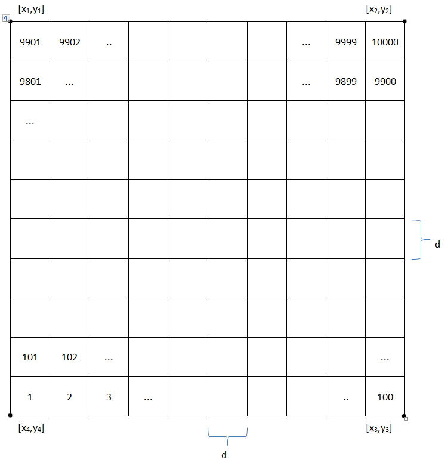
(https://dandelion.eu/media/uploads/images/Milano_GRID_4326.png, 2017. 12. 02.)
A képen látható koordináták és távolságok a következők:
```
[x1,y1] = [ 9.011533669936474, 45.56821407553667 ]
[x2,y2] = [ 9.312688264185276, 45.56778671132765 ]
[x3,y3] = [ 9.311521155996243, 45.356261753717845 ]
[x4,y4] = [ 9.011490619692509, 45.356685994655464 ]
d: 235 m
```
(https://dandelion.eu/datagems/SpazioDati/milano-grid/description/, 2017. 12. 02.)

#### Feladat

A feladatom ennek az adathalmaznak a segítségével anomáliákat keresni a felhasználói aktivitásban. Anomáliának tekintsük az átlagos aktivitástól eltérő aktivitást. De mi az az aktivitás, a átlagos aktivitás és az átlagos aktivitástól eltérő aktivitás?
- **Aktivitás:** egy valós szám, ami a felhasználók internethasználatából, az indított vagy fogadott telefonhívások számából és a küldött vagy kapott SMS-ek számából lett generálva. Mivel az előbb említett számok megtalálhatóak az adathalmazban minden négyzetre és időpontra, ezért azokat tudjuk használni az aktivitás kiszámítására. Az aktivitás tartozhat egy terület és egy időintervallum párosához, például a 42-es négyzeten 2013 december 3-án 10:00-tól 10:10-ig vagy a 3-as négyzeten 2013 november első napjától november utolsó napjáig. Így ha minél nagyobb időintervallumot veszünk, valószínűleg annál nagyobb aktivitást is fogunk kapni.
- **Átlagos aktivitás:** egy szám, ami egy terület egy napon belüli időintervallumához tartozik. Például a 42-es négyzeten 15:10-től 15:20-ig. Az átlagos aktivitást egy terület egy időintervallumához úgy számoljuk ki, hogy vesszük az összes olyan már ismert aktivitást, ami arra a területre és arra az időintervallumra vonatkozik és ezeket átlagoljuk. Az előző példánál maradva (42-es négyzeten 15:10-től 15:20-ig), az átlagos aktivitást kiszámolhatjuk a 42-es négyzet 2013 november 1. 15:10 - 15:20, november 2. 15:10 - 15:20, stb aktivitásokból. Ha már legalább 2-ből számultuk ki, akkor azt már átlagosnak tekintjük, még ha abból nem is lehet sok következtetést levonni.
- **Átlagos aktivitástól eltérő aktivitás (anomália):** egy szám, ami egy átlagos aktivitáshoz és egy aktivitáshoz tartozik, ahol a terület és az időintervallum is megegyezik. Ezt a számot az adott átlagos aktivitásból és az adott aktivitásból (nevezzük ezt aktuálisnak) számoljuk ki. A szám arra kell, hogy reflektáljon, hogy történt-e a területen az aktuális időintervallumban valami szokatlan esemény, mint például egy sport rendezvény vagy egy színházi előadás.

### Az adathalmaz felosztása

Hogy megfelelő mennyiségű aktivitásból számoljam ki az átlagos aktivitást, ezért az adathalmazt 2 részre osztom:
- A novemberi adatokat használom arra, hogy kiszámoljam az átlagos aktivitást az összes területre és az összes időintervallumra. Ezeket az adatok még csoportosítom aszerint, hogy egy nap hétvégére vagy hétköznapra esik. Tehát például az átlagos aktivitás a 42-es négyzeten 15:10 és 15:20 közt más lesz, ha egy hétköznapot és más lesz, ha egy hétvégét nézünk. Ez azért szükséges, mert egy átlagos hétvégén az aktivitás kissebb, mint egy átlagos hétköznapon. Például itt van a 6547-es területen a hétvége és a hétköznap:
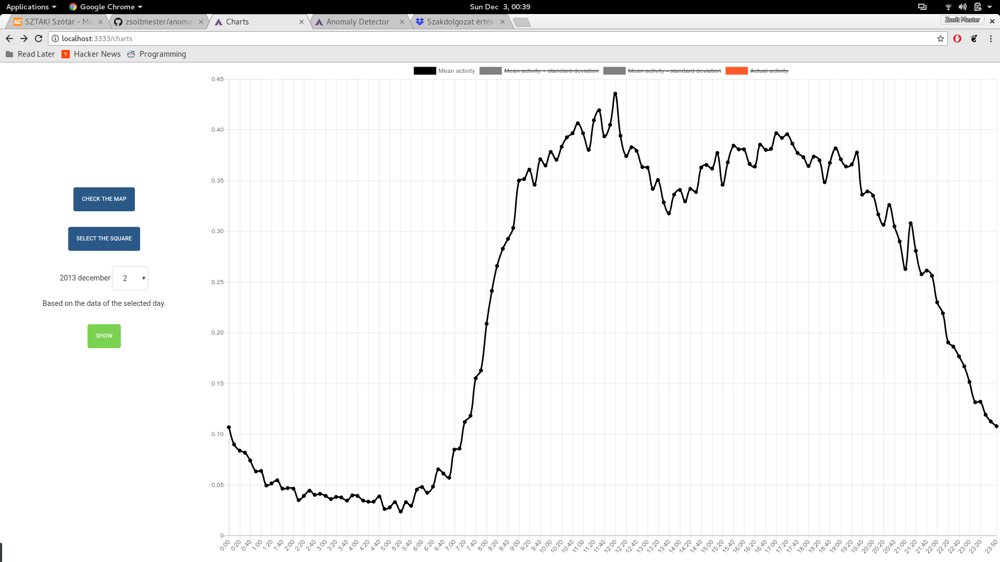
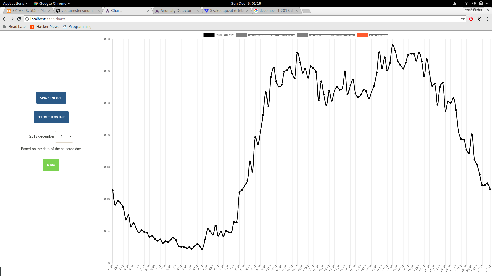
Látható, hogy hétvégén napközben 0.25 és 0.35 közt mozgott aktivitás, míg hétköznap 0.35 és 0.45 közt.
Ha több évnyi adat állna rendelkezésre, akkor érdemes lenne a hét minden napjára lebontani az átlagos aktivitást.
- A decemberi adatok lesznek a teszt adatok. Az alkalmazásban is decemberből lehet majd időintervallumot kiválasztani, mind a szimulációnál, mind a grafikonoknál.

### Az alkalmazás komponensei

Az alkalmazás 3 komponensből épül fel:
- Egy script, ami feldolgozza az adatokat és kiszámolja az átlagos novemberi aktivitást és az aktivitás szórását minden négyzetre és minden időintervallumra (beleértve a hétvégét és a hétköznapot is). Ezen felül még kiszámolja december minden időintervallumára és minden területére az aktivitást. Az adatokat egy adatbázisba menti el.
- Egy backend komponens, aki az adatbázist tudja olvasni. Tőle kérhetők le adatok az adatbázisból.
- Egy frontend komponens, ami a szimuláció és a grafikonok megjelenítésért felel.

A 3 komponens kapcsolata:
- A skript nem tud sem a backendről, sem a frontendről, ő csak az adatbázis elkészítéséért felel.
- A backend nem tud semmit a frontendről, ő csak az script által generált adatbázis olvasásáért felel.
- A frontend a backendtől tudja lekérdezni az neki éppen szükséges adatokat.

#### Skript

> Egy skript, ami feldolgozza az adatokat és kiszámolja az átlagos novemberi aktivitást és az aktivitás szórását minden négyzetre és minden időintervallumra (beleértve a hétvégét és a hétköznapot is). Ezen felül még kiszámolja december minden időintervallumára és minden területére az aktivitást. Az adatokat egy adatbázisba menti el.

Ez egy Python skript lesz. Azért a Python-t választottam, mert:
- népszerű nyelv a közösség körében a mesterséges tanulásos algoritmusokhoz és alkalmazásokhoz, így az interneten könnyen találhatok választ a kérdéseimre.
- a *NumPy* és *scikit-learn* library-kre tudok támaszkodni, ha mesterséges tanulással kapcsolatos algoritmust akarok futtatni.

A következő paraméterekkel lehet inicializálni az algoritmust:
```
-h, --help            show this help message and exit
-a {visualize,save}, --action {visualize,save}
					  Which action to perform. The vizualization will display the polinoms. The save will insert the results to a database.
--training TRAINING   Path to the root directory of the training dataset. It can be relative or aboslute.
--testing TESTING     Path to the root directory of the testing dataset. It can be relative or aboslute.
--square_from SQUARE_FROM
					  The first square to analyze. It can be a value from 1 to 10000. It can be the equal or less than --square_to.
--square_to SQUARE_TO
					  The last square to analyze. It can be a value from 1 to 10000. It can be the equal or greater --square_from.
-f {sms-in,sms-out,call-in,call-out,internet} [{sms-in,sms-out,call-in,call-out,internet} ...], --features {sms-in,sms-out,call-in,call-out,internet} [{sms-in,sms-out,call-in,call-out,internet} ...]
					  Which features to use to generate the activities. Also, comma separated values are valid, which means it will combine the given features. By default, it combines all the features.
```
A két féle futási mód a vizualizáció és a mentés. Az előbbi tesztelésre lesz hasznos, az utóbbi pedig magának a skriptnek a célja.
A *--square_from* és a *--square_to* kapcsolók azért fognak kelleni, hogy kevesebb memóriával rendelkező gépeken is tudjon futni a script. A scriptnek azért lesz nagy a memória igénye, mert be kell olvasnia 20 GB szöveges fájlt és a memóriába kell addig tartania, még fel nem dolgozza azokat.
A *--features* kapcsoló teszteléshez lesz hasznos. De a végleges adatbázis legeneráláshoz nem kell használni, hisz ott az összes feature-ből szeretnénk legenerálni az aktivitást.

A skript az *Adathalmaz* fejezetben leírt adatfájlokból dolgozik. Ezeket a fájlokat el kell helyezni egy-egy mappában, az egyikben a novemberiket, egy másikban a decemberiket. Például így:
```
zsmester@thinkpad:~/big-data-repository/milano/cdr$ tree
.
├── 2013-11
│   ├── sms-call-internet-mi-2013-11-01.txt
│   ├── sms-call-internet-mi-2013-11-02.txt
#...
│   ├── sms-call-internet-mi-2013-11-29.txt
│   └── sms-call-internet-mi-2013-11-30.txt
└── 2013-12
    ├── sms-call-internet-mi-2013-12-01.txt
    ├── sms-call-internet-mi-2013-12-02.txt
	#...
    ├── sms-call-internet-mi-2013-12-30.txt
    └── sms-call-internet-mi-2013-12-31.txt

2 directories, 61 files
```
A skriptnek ezeknek a mappáknak relatív vagy abszolút útvonalát kell megadni a *--training* és a *--testing* kapcsolók segítségével.

A scriptet fel lehet osztani funkciók mentén különböző modulokra:
- **detect_anomaly.py**: Ez a belépési pont. Ezt kell elindítani az előbb írt argumentumokkal.
- **initialise.py**: Tartalmazza az inicializáláshoz szükséges logikát, mint például az argumentumok beolvasása.
- **common_function.py**: Biztosan lesz pár olyan függvény, amit több modulból is szeretnénk hívni, de nem tartozik egyikhez sem, mert azoknál általánosabb (például egy sor hozzáadása egy mátrixhoz), akkor azokat ide tesszük.
- **constants.py**: Azok a konstansok, amik nem fognak változni a skript futtása alatt.
- **preprocess.py**: Az adathalmaz feldogozásához szükséges logikát fogja tartalmazni.
- **display.py**: Ha vizualizációs módban indítottuk el a skriptet, akkor ezt a modult fogja beimportálni, hogy megjelenítse a grafikonokat.
- **interpolate.py**: Ha vizualizációs módban indítottuk a skriptet, akkor ennek a modulnak a segítségével kell, hogy előállítsa a polinomokat az aktivitásból.
- **save.py**: Ha mentés módban indítottuk a skriptet, akkor ennek a modulnak a segítségével kell feltölteni az adatbázist.

A skript a következőket csinálja, sorrendben:
1. Beolvassa az argumentumokat. Ehhez az *initialise* modult használja. Az algumentumok alapján:
	- összegyűjti a tanuláshoz és a teszteléshez szükséges fájlokat,
	- azt a területet, amit elemezni kell
	- és azokat a feature-öket, amiket használnia fog.
- Betölti a memóriába a fájlok tartalmát. Ehhez az *preprocess* modult használja.
- Végigmegy az összes négyzeten:
	1. Előfeldogozza az adott négyzet adatait, amihez a *preprocess* modult használja:
		1. Időintervallum szerint csoportosítja az adatokat.
		- Felbontja hétköznapokra és hétvégékre, majd mindkettőn végigmegy:
			1. Egy min-max scaler segítségével összehasonlíthatóvá teszi a feature-öket.
			- Kiszámolja a feature-ök átlagát.
			- Timestamp szerint rendezi az adatokat.
	- A tanító adathalmazból kidobja az outliereket.
	- A tanító adathalmazhoz kiszámolja az átlagos aktivitást minden időintervallumra.
	- A tanító adathalmazhoz kiszámolja a szórást minden időintervallumra.
	- A tesztelő adathalmazt napokra csoportosítja.
	- Ha vizualizációs módban fut, akkor kiszámloja az átlagos és a aktiális aktivitáshoz az interpolációs polinomot az adott négyzetre, és megjeleníti azt.
	- Ha mentés módban fut, akkor elmenti a négyzet kiszámolt adatait az adatbázisba.

##### Adatbázis

Egy fájl alapú adatbáziskezelő rendszert választottam, mert az adatbázisnak hordozhatónak és verziókezelő alatt nyomonkövethetőnek kell lennie. A fájl alapú adatbáziskezelő rendszerek közül az SQLite a legnépszerűbb, ezért azt választottam, így biztos voltam benne, hogy a kezeléséhez találok karbantartott Python és Javascript library-t.

Az adatbázis egyetlen táblát fog tartalmazni, aminek **squares** lesz a neve. Ebben a következő mezők vannak:
- **square, integer**: Négyzet azonosító. Értéke egy 1 és 10000 közti egész szám.
- **day, integer**: December egy napjának száma. Értéke egy 1 és 31 közti egész szám.
- **minutes, integer**: Az adott napon az éjfél óta eltet percek száma. Értéke egy 0 és 1439 közti egész szám.
- **mean_activity, real**: Az adott négyzethez, naphoz, időponthoz tartozó átlagos aktivitás novemberből. Egy nullánál nagyobb valós szám.
- **standard_deviation, real**: Az adott négyzethez, naphoz, időponthoz tartozó átlagos aktivitás szórása novemberből. Egy nullánál nagyobb valós szám.
- **actual_activity, real**: Az adott négyzethez, decemberi naphoz, időponthoz tartozó aktivitás. Egy nullánál nagyobb valós szám.

#### Backend

TODO

#### Frontend

TODO

## Megvalósítás

### Script

A forráskód az *algorithm* mappában található meg. Itt a megoldási tervben definiált Python fájlok vannak.

A forráskód PEP 8 szerint van formázva. A PEP 8 a Python fejlesztői által ajánlott és a legelterjedtebb formázási stílus. A kódot a 2.3.1-es *pycodestlye*-al validálom. Az *algorithm* mappában található *setup.cfg* a *pycodestlye* opcionális konfigurációs fájla. Csak annyit tettem bele, hogy ne generáljon warningot a hosszú sorok miatt. A kód ellenőrzőt az *algorithm* mappában indított *pycodestlye* parancsal lehet futtatni. Hiba esetén kiírja a hibák helyét és hogy mi volt a probléma az egyes helyeken; hiba hiányában viszont nem ír ki semmit. Példa hibákra:
```
zsmester@thinkpad:~/anomaly-detector/algorithm$ pycodestyle
./common_function.py:42:36: E201 whitespace after '('
./constant.py:13:14: E222 multiple spaces after operator
./detect_anomaly.py:105:14: E261 at least two spaces before inline comment
./display.py:17:104: E251 unexpected spaces around keyword / parameter equals
```
A végleges forráskódra nem ír hibát.

3.5-ös verziójú Python-t használtam, a környezet összerakásához pedig 1.6.5-ös *Anaconda Cloud command line manager*-t. Utóbbi segítségével fértem hozzá az alábbbi library-khez:
- *numpy*
- *sklearn*
- *matplotlib*: A grafikonok megjelenítéséhez.
- *scipy*: Az interplációs függvényekhez.

A megoldási tervenek megfelelően készítettem el a következő modulokat (kiemelve a fontosabb függvényiket a dokumentációjukkal együtt):
- **detect_anomaly.py**: A megoldási tervnek megfelelően ez a belépési pont, a skript csak akkor fut, ha konkréten ez a file lett futtatva, és nem csak importálva: `if __name__ == '__main__':`.
- **initialise.py**
```python
def initialise():
    """Initialises the algorithm's parameters.

    Parses the script's arguments. Based on that, it returns the initial parameters of the alogrithm.

    Returns:
        A tuple, with the following elements.
        - 1.: What action to perform. It can be constant.ACTION_VISUALIZE or constant.ACTION_SAVE.
        - 2.: List of the paths (as strings) of the training files.
        - 3.: List of the paths (as strings) of the testing files.
        - 4.: List of squares (as ints) to analyze.
        - 5.: List of the features to combine. The valid values are the constant.FEATURE_* global constants.
    """
```
- **common_function.py**: Például:
```python
def sort_arrays_based_on_the_first(first_array, second_array):
    """Sort the first array then the second in the same order as the first.

    Args:
        first_array: The first array to sort.
        second_arrays: The second array to sort.

    Returns:
        A tuple with the sorted first and second array.
    """
```
- **constants.py**
- **preprocess.py**:
```python
def load_squares(files, squares):
    """Returns the given squares from the given files.

    Args:
        files: Paths to the files. It must be an iterable on strings.
        squares: The squares to load. It must be a list of integers.

    Returns:
        A dictionary, where the keys are the squares (as ints) and the values are the features with values, as dictionaries.
    """
```
- **display.py**
- **interpolate.py**:
```python
def create_interpolation_polynomial(x_points, y_points):
    """Create the interpolation polynomial based on the given x and y points.

    It is using spline interpolation.

    Args:
        x_points: The x points as a list of ints.
        y_points: The y points as a list of ints.
        len(x_points) == len(y_points)

    Returns:
        The x and y points in a dictionary that represent the interpolation polynomial. It looks like this:
        { constant.X: x, constant.Y: y}
    """
```
- **save.py**:
```python
def write_square_to_database(square, mean_activities, actual_activities, standard_deviations):
    """Saves the given square's properties to an SQLite database.

    Args:
        square: The square ID, as an int.
        mean_activities: The mean activities based on the training data in form { day_number_as_int: { minutes: mean activity, ...}, ... }.
        actual_activities: The actual activities in form { day_number_as_int: { minutes: actual activity, ...}, ... }.
        standard_deviations: The standard deviations of the training data in form { day_number_as_int: { minutes: standard deviation, ...}, ... }.
    """
```

A forráskód docstring-ek segítségével dokumentálva van, amiből HTML dokumentációt a *Sphinx*-el lehet generálni. Az *algoritm/docs* könyvtárban egy *make html* parancsot futtatva a *_build/html* könyvtárba generálódik le a HTML dokumentáció, ami így néz ki:
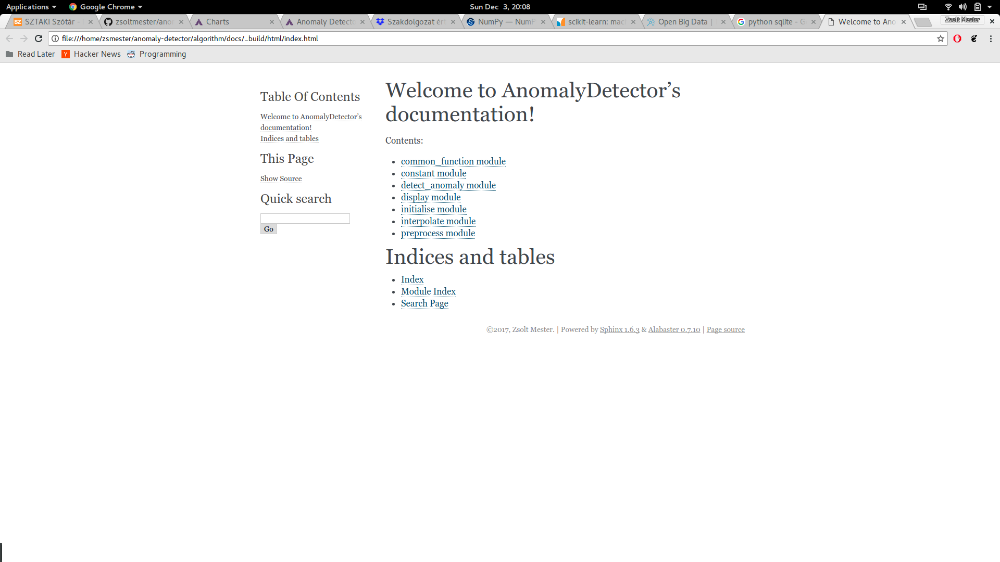
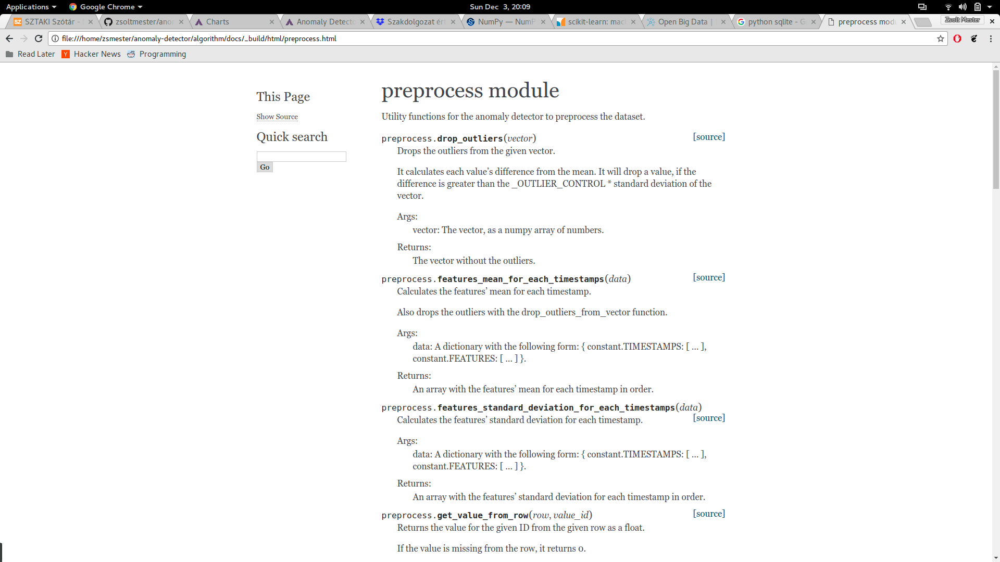
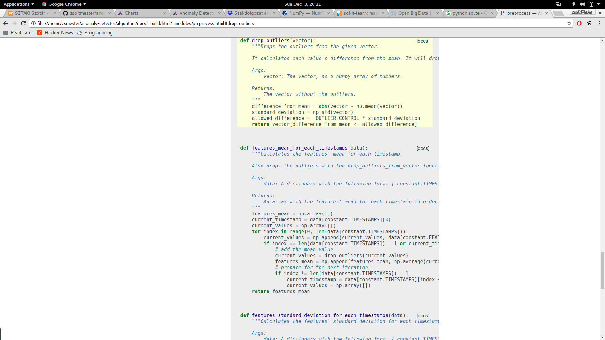

A skriptet a megoldási tervben leírt paraméterekkel lehet futtatni. Az *algorithm* mappában található egy *run-anomaly-detector.sh* bash skript, amit az *erdos.inf.elte.hu* szerveren használtam az adatbázis legenerálásához. 10 menetben készítettem el a teljes adatbázist, hogy ne foglaljam le a szerver összes memóriáját a futás alatt:
```bash
# ...
python3 detect_anomaly.py --training /mnt/disk2/tim-bd-challenge/milano-november/ --testing /mnt/disk2/tim-bd-challenge/milano-december/ --square_from 2000 --square_to 2999 --action save > log3000.txt 2>&1
# ...
```
A végleges adatbázis 1.9 GB lett.

Az algoritmus tesztelésére használható a *visualize* mód, például így: `python detect_anomaly.py --training ~/big-data-repository/milano/cdr/2013-11 --testing ~/big-data-repository/milano/cdr/2013-12 --square_from 1 --square_to 1 --action visualize`:
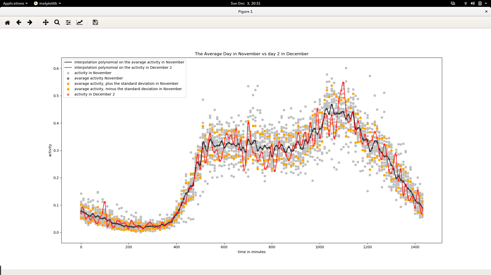

### Webapp

TODO

## Tesztelés

TODO
